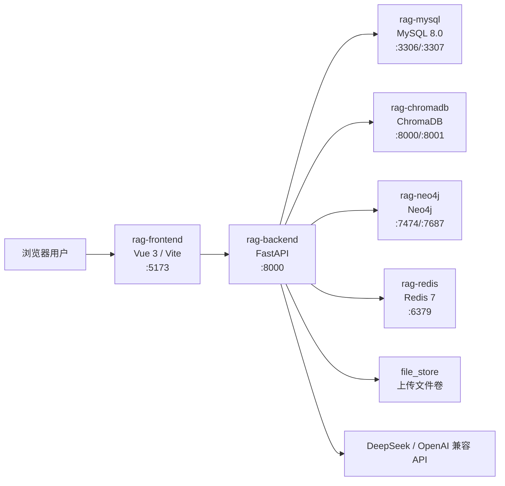
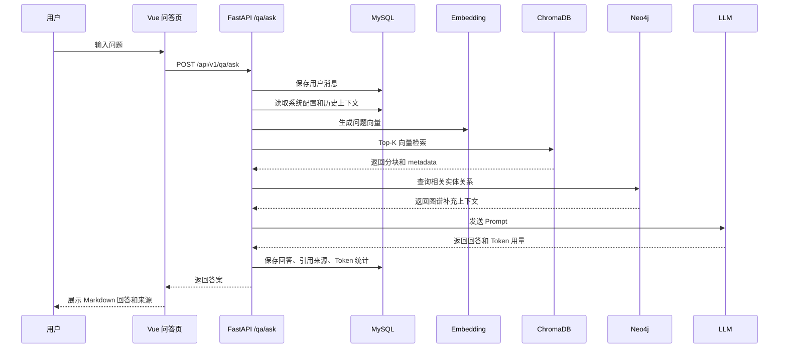
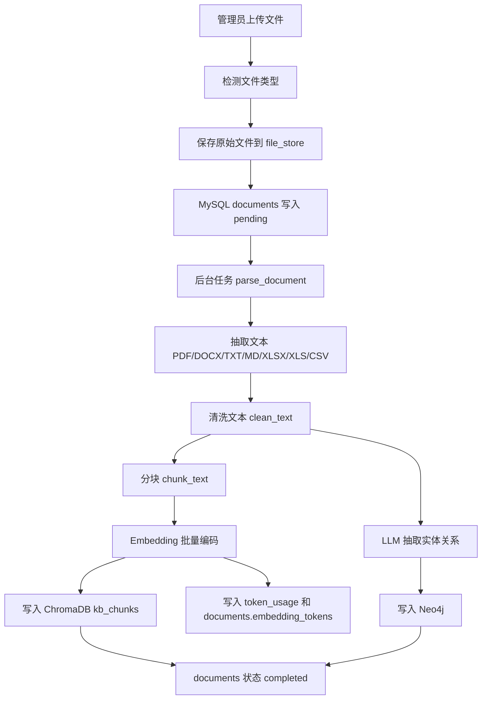
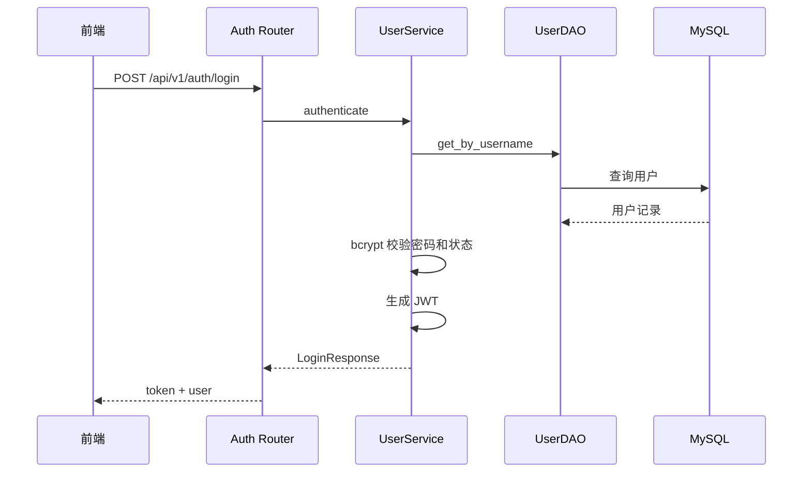
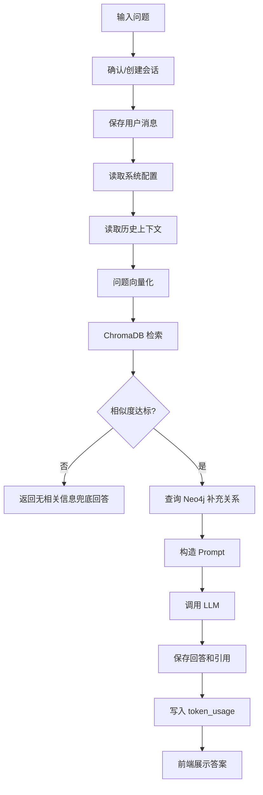
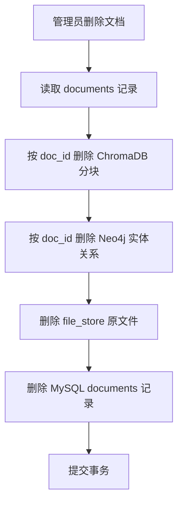

# 基于 RAG 架构的智能问答系统详细设计说明书

文档版本：最终版  
项目名称：基于 RAG 架构的智能问答系统  
文档名称：RAG-详细设计说明书-课设  
生成日期：2026-06-03  
依据文件：`docker/backend`、`docker/frontend`、`docker/docker-compose.yml`、`docker/mysql/init.sql`

## 1. 引言

### 1.1 编写目的

本文档描述课程设计最终版本的详细设计，包括系统架构、模块划分、前后端结构、接口设计、数据库访问、RAG 问答流程、文档入库流程、知识图谱流程、安全设计、异常处理和部署运行设计。文档面向开发、测试、部署和课程答辩，用于说明系统如何从需求落地到可运行实现。

### 1.2 系统概述

系统是一个基于检索增强生成（Retrieval-Augmented Generation，RAG）的私有知识库智能问答系统。管理员可以上传内部文档，系统自动完成文本解析、分块、向量化和知识图谱抽取；普通用户可以基于知识库进行多轮问答，回答结果包含引用来源和图谱增强信息。

### 1.3 技术栈

| 层级 | 技术 |
| --- | --- |
| 前端 | Vue 3、Vite、Vue Router、Pinia、Element Plus、Axios、ECharts、Markdown-It |
| 后端 | FastAPI、SQLAlchemy Async、Pydantic、python-jose、Passlib/bcrypt、httpx |
| 关系型数据库 | MySQL 8.0 |
| 向量数据库 | ChromaDB |
| 图数据库 | Neo4j |
| 缓存与任务支撑 | Redis、Celery |
| 文档解析 | pdfplumber、python-docx、openpyxl、csv |
| 部署 | Docker、Docker Compose |

## 2. 系统总体设计

### 2.1 部署架构



### 2.2 后端分层

| 层级 | 目录 | 职责 |
| --- | --- | --- |
| 应用入口 | `app/main.py` | 创建 FastAPI 应用、注册 CORS、挂载路由 |
| 路由层 | `app/routers` | 接收 HTTP 请求、参数校验、权限控制、调用服务 |
| 服务层 | `app/services` | 业务流程编排，如 RAG、文档解析、图谱管理、模型管理 |
| DAO 层 | `app/dao` | MySQL、ChromaDB、Neo4j、文件存储访问 |
| 模型层 | `app/models` | SQLAlchemy ORM 模型 |
| 工具层 | `app/utils` | Embedding、LLM、加密、文本处理、知识图谱抽取、日志 |
| 任务层 | `app/tasks` | Celery 任务定义和后台任务扩展 |

### 2.3 前端分层

| 层级 | 目录 | 职责 |
| --- | --- | --- |
| 应用入口 | `src/main.js`、`src/App.vue` | Vue 应用初始化 |
| 路由 | `src/router/index.js` | 页面路由、登录守卫、角色守卫 |
| 页面 | `src/views` | 登录、问答、知识库、图谱、工作台等页面 |
| 布局组件 | `src/components/layout/Sidebar.vue` | 左侧导航和主内容布局 |
| 状态管理 | `src/stores` | 登录用户、问答会话状态 |
| API 封装 | `src/api` | Axios 客户端和各模块接口封装 |
| 样式 | `src/styles/clay.css` | 全局 UI 样式 |

### 2.4 后端路由分组

| 分组 | 前缀 | 路由文件 | 说明 |
| --- | --- | --- | --- |
| 认证 | `/api/v1/auth` | `routers/auth.py` | 登录、注册、当前用户、修改密码、个人统计 |
| 文档管理 | `/api/v1/documents` | `routers/documents.py` | 上传、列表、预览、重解析、删除、批量操作 |
| 智能问答 | `/api/v1/qa` | `routers/qa.py` | 提问、会话列表、消息列表、可用模型 |
| 知识图谱 | `/api/v1/graph` | `routers/graph.py` | 图谱总览、实体、关系、搜索、邻居、抽取 |
| 用户管理 | `/api/v1/users` | `routers/users.py` | 用户列表、新增、编辑、重置密码、启停 |
| 问答历史 | `/api/v1/history` | `routers/history.py` | 管理员历史、个人历史、详情、统计 |
| 工作台 | `/api/v1/dashboard` | `routers/dashboard.py` | 统计、趋势、存储、系统状态 |
| 系统配置 | `/api/v1/config` | `routers/config.py` | 参数读取、批量更新、系统信息 |
| 模型管理 | `/api/v1/models` | `routers/models.py` | 供应商、模型配置、提示词、预设、用量统计 |

## 3. 前端详细设计

### 3.1 路由设计

| 路由 | 页面组件 | 权限 | 功能 |
| --- | --- | --- | --- |
| `/login` | `views/Login.vue` | 公开 | 登录 |
| `/dashboard` | `views/admin/Dashboard.vue` | 管理员 | 工作台统计 |
| `/knowledge` | `views/admin/Knowledge.vue` | 管理员 | 知识库管理 |
| `/graph` | `views/admin/Graph.vue` | 管理员 | 知识图谱管理 |
| `/users` | `views/admin/Users.vue` | 管理员 | 用户管理 |
| `/history` | `views/admin/History.vue` | 管理员 | 全局问答历史 |
| `/model` | `views/admin/Model.vue` | 管理员 | 模型与 API 管理 |
| `/config` | `views/admin/Config.vue` | 管理员 | 系统配置 |
| `/qa` | `views/user/QA.vue` | 登录用户 | 智能问答 |
| `/my-history` | `views/user/MyHistory.vue` | 登录用户 | 我的历史 |
| `/profile` | `views/user/Profile.vue` | 登录用户 | 个人中心 |

### 3.2 路由守卫

前端在 `src/router/index.js` 中实现全局路由守卫：

1. 若目标页面需要登录且本地无 Token，跳转 `/login`。
2. 已登录用户访问 `/login` 时，根据角色跳转管理员工作台或问答页。
3. 若路由设置 `meta.role='admin'` 且当前用户不是管理员，跳转 `/qa`。
4. 其他情况正常放行。

### 3.3 API 客户端设计

前端 API 模块位于 `src/api`：

| 文件 | 对应后端模块 | 说明 |
| --- | --- | --- |
| `client.js` | 通用 | Axios 实例、Base URL、请求/响应拦截 |
| `auth.js` | 认证 | 登录、注册、当前用户、修改密码 |
| `qa.js` | 问答 | 提问、会话、消息、模型列表 |
| `documents.js` | 文档 | 上传、列表、预览、删除、重解析 |
| `graph.js` | 图谱 | 图谱总览、实体、关系、搜索 |
| `users.js` | 用户 | 管理员用户管理 |
| `history.js` | 历史 | 个人和全局历史 |
| `dashboard.js` | 工作台 | 统计、趋势、系统状态 |
| `config.js` | 系统配置 | 参数获取和保存 |
| `models.js` | 模型 | 供应商、配置、预设、用量 |

### 3.4 状态管理

| Store | 文件 | 状态内容 | 说明 |
| --- | --- | --- | --- |
| 认证状态 | `stores/auth.js` | Token、用户信息、登录状态 | 与 `localStorage` 同步 |
| 问答状态 | `stores/qa.js` | 会话列表、当前会话、消息列表、加载状态 | 支撑问答页面 |

## 4. 后端详细设计

### 4.1 应用入口

`app/main.py` 创建 FastAPI 应用：

- 应用标题：`RAG 智能问答系统`。
- API 版本：`1.0.0`。
- 全局启用 CORS。
- 注册 9 个业务路由分组。
- 提供 `/health` 健康检查接口。

### 4.2 配置管理

`app/config.py` 使用 `pydantic-settings` 读取环境变量：

| 配置类别 | 关键变量 |
| --- | --- |
| MySQL | `MYSQL_HOST`、`MYSQL_PORT`、`MYSQL_USER`、`MYSQL_PASSWORD`、`MYSQL_DATABASE` |
| Redis | `REDIS_HOST`、`REDIS_PORT`、`REDIS_PASSWORD` |
| Neo4j | `NEO4J_URI`、`NEO4J_USER`、`NEO4J_PASSWORD` |
| ChromaDB | `CHROMA_HOST`、`CHROMA_PORT` |
| JWT | `JWT_SECRET_KEY`、`JWT_ALGORITHM`、`JWT_EXPIRE_HOURS` |
| 加密 | `ENCRYPTION_KEY` |
| LLM | `DEEPSEEK_API_KEY`、`DEEPSEEK_BASE_URL` |

### 4.3 数据访问设计

| DAO | 访问对象 | 关键方法 |
| --- | --- | --- |
| `user_dao.py` | `users` | 按 ID/用户名查询、分页列表、创建、更新、删除 |
| `document_dao.py` | `documents` | 查询、分页、创建、状态更新、版本递增、删除 |
| `conversation_dao.py` | `conversations` | 创建、用户会话列表、删除、标题更新 |
| `message_dao.py` | `messages` | 创建消息、查询会话消息、查询历史上下文、按 ID 查询 |
| `config_dao.py` | `system_config` | 获取配置、按 Key 获取、批量更新 |
| `model_dao.py` | 模型相关表 | 供应商、模型配置、默认模型、预设 CRUD |
| `token_usage_dao.py` | `token_usage` | 创建消耗记录、汇总统计 |
| `chroma_repo.py` | ChromaDB | Collection 获取、查询、批量写入、按文档删除、健康检查 |
| `neo4j_repo.py` | Neo4j | 子图查询、总览、实体和关系 CRUD、按文档删除、健康检查 |
| `file_store.py` | 文件卷 | 保存、读取、删除、文件大小 |

## 5. M1 智能问答模块

### 5.1 功能目标

智能问答模块为登录用户提供基于私有知识库的多轮问答。系统对用户问题进行向量化检索，结合相似文档片段、历史上下文和知识图谱补充信息构造 Prompt，调用 Chat 模型生成回答，并保存问答记录、引用来源和 Token 消耗。

### 5.2 参与文件

| 类型 | 文件 |
| --- | --- |
| 前端页面 | `frontend/src/views/user/QA.vue` |
| 前端 Store | `frontend/src/stores/qa.js` |
| 前端 API | `frontend/src/api/qa.js` |
| 后端路由 | `backend/app/routers/qa.py` |
| 后端服务 | `backend/app/services/qa_service.py` |
| DAO | `conversation_dao.py`、`message_dao.py`、`model_dao.py`、`chroma_repo.py`、`neo4j_repo.py`、`token_usage_dao.py` |
| 工具 | `utils/embedding.py`、`utils/llm_client.py` |

### 5.3 核心流程



### 5.4 RAG 处理逻辑

`qa_service.rag_pipeline` 的主要步骤：

1. 读取系统配置：`top_k`、`similarity_threshold`、`history_rounds`、`kg_enabled`、`temperature`、`top_p`、`max_tokens`。
2. 保存用户提问到 `messages`。
3. 查询最近多轮历史，构造对话上下文。
4. 调用 Embedding 模型对问题编码。
5. 调用 ChromaDB 查询相似文档分块。
6. 将距离转换为相似度，低于阈值的分块不进入上下文。
7. 若无有效上下文，返回“知识库中暂无相关信息”的兜底回答。
8. 若启用知识图谱，从问题中提取中文词并查询 Neo4j 子图。
9. 获取指定 Chat 模型或默认 Chat 模型。
10. 拼接系统提示词、参考资料、历史对话、图谱补充和回答要求。
11. 调用 LLM 生成答案。
12. 写入 `token_usage` 的 Chat Token 记录。
13. 保存机器人消息，包含 `sources`、`kg_references`、`model_name`、`tokens_used`。

### 5.5 问答接口

| 方法 | 路径 | 权限 | 功能 |
| --- | --- | --- | --- |
| POST | `/api/v1/qa/ask` | 登录用户 | 提交问题并返回 RAG 回答 |
| GET | `/api/v1/qa/conversations` | 登录用户 | 获取当前用户会话列表 |
| POST | `/api/v1/qa/conversations` | 登录用户 | 创建会话 |
| DELETE | `/api/v1/qa/conversations/{conv_id}` | 会话所有者 | 删除会话 |
| GET | `/api/v1/qa/conversations/{conv_id}/messages` | 会话所有者 | 获取会话消息 |
| GET | `/api/v1/qa/models` | 登录用户 | 获取可用 Chat 模型 |

## 6. M2 知识库管理模块

### 6.1 功能目标

知识库管理模块支持管理员上传、查看、预览、更新、删除和批量重解析文档。系统将文档解析成文本分块并写入向量库，同时抽取知识实体和关系写入图数据库。

### 6.2 参与文件

| 类型 | 文件 |
| --- | --- |
| 前端页面 | `frontend/src/views/admin/Knowledge.vue` |
| 前端 API | `frontend/src/api/documents.js` |
| 后端路由 | `backend/app/routers/documents.py` |
| 后端服务 | `backend/app/services/document_service.py` |
| DAO | `document_dao.py`、`file_store.py`、`chroma_repo.py`、`neo4j_repo.py`、`token_usage_dao.py` |
| 工具 | `text_processor.py`、`embedding.py`、`kg_extractor.py` |

### 6.3 文档入库流程



### 6.4 文档状态

| 状态 | 说明 |
| --- | --- |
| `pending` | 文档已上传，等待解析 |
| `parsing` | 正在抽取文本、向量化、图谱抽取 |
| `completed` | 解析完成，可参与问答 |
| `failed` | 解析失败，错误写入 `error_message` |

### 6.5 支持文件类型

| 类型 | 扩展名 | 解析实现 |
| --- | --- | --- |
| PDF | `.pdf` | `pdfplumber.open` 逐页抽取文本 |
| DOCX | `.docx` | `python-docx` 抽取段落 |
| TXT | `.txt` | UTF-8 文本读取 |
| MD | `.md` | UTF-8 文本读取 |
| XLSX/XLS | `.xlsx` / `.xls` | `openpyxl` 按工作表读取 |
| CSV | `.csv` | `csv.reader` 逐行读取 |

### 6.6 文档接口

| 方法 | 路径 | 权限 | 功能 |
| --- | --- | --- | --- |
| GET | `/api/v1/documents/stats` | 管理员 | 文档统计 |
| GET | `/api/v1/documents` | 管理员 | 分页查询文档 |
| POST | `/api/v1/documents/upload` | 管理员 | 上传文档 |
| GET | `/api/v1/documents/{doc_id}` | 管理员 | 文档详情 |
| GET | `/api/v1/documents/{doc_id}/preview` | 管理员 | 文档文本预览 |
| POST | `/api/v1/documents/{doc_id}/update` | 管理员 | 更新文档文件并递增版本 |
| DELETE | `/api/v1/documents/{doc_id}` | 管理员 | 删除文档、向量和图谱数据 |
| POST | `/api/v1/documents/{doc_id}/reparse` | 管理员 | 重新解析单个文档 |
| POST | `/api/v1/documents/reparse-all` | 管理员 | 重解析全部文档 |
| POST | `/api/v1/documents/delete-all` | 管理员 | 删除全部文档 |
| POST | `/api/v1/documents/batch-delete` | 管理员 | 批量删除 |
| POST | `/api/v1/documents/batch-reparse` | 管理员 | 批量重解析 |
| POST | `/api/v1/documents/cleanup-orphans` | 管理员 | 清理孤立图谱实体 |

## 7. M3 知识图谱管理模块

### 7.1 功能目标

知识图谱模块用于展示和维护文档抽取出的实体关系。管理员可以查看图谱总览、搜索实体、按类型筛选、增删改实体和关系，并手动触发指定文档的图谱抽取。

### 7.2 参与文件

| 类型 | 文件 |
| --- | --- |
| 前端页面 | `frontend/src/views/admin/Graph.vue` |
| 前端 API | `frontend/src/api/graph.js` |
| 后端路由 | `backend/app/routers/graph.py` |
| 后端服务 | `backend/app/services/kg_service.py` |
| DAO | `backend/app/dao/neo4j_repo.py` |
| 工具 | `backend/app/utils/kg_extractor.py` |

### 7.3 图谱数据设计

| 对象 | 说明 |
| --- | --- |
| Entity 节点 | 保存实体名称、类型、描述、来源文档 ID |
| 动态关系 | 保存实体之间的语义关系 |
| 可视化数据 | 后端将 Neo4j 查询结果转换为 `nodes` 和 `edges` |
| 问答增强 | RAG 流程按问题关键词查询子图并拼入上下文 |

### 7.4 图谱接口

| 方法 | 路径 | 权限 | 功能 |
| --- | --- | --- | --- |
| GET | `/api/v1/graph/overview` | 管理员 | 图谱总览 |
| GET | `/api/v1/graph/entities` | 管理员 | 实体列表 |
| POST | `/api/v1/graph/entities` | 管理员 | 新增实体 |
| PUT | `/api/v1/graph/entities/{entity_id}` | 管理员 | 更新实体 |
| DELETE | `/api/v1/graph/entities/{entity_id}` | 管理员 | 删除实体 |
| GET | `/api/v1/graph/entities/{entity_id}/neighbors` | 管理员 | 查询邻居 |
| GET | `/api/v1/graph/search` | 管理员 | 关键词搜索 |
| GET | `/api/v1/graph/filter` | 管理员 | 按实体类型筛选 |
| GET | `/api/v1/graph/relations` | 管理员 | 关系列表 |
| POST | `/api/v1/graph/relations` | 管理员 | 新增关系 |
| DELETE | `/api/v1/graph/relations` | 管理员 | 删除关系 |
| POST | `/api/v1/graph/extract/{doc_id}` | 管理员 | 手动抽取指定文档图谱 |

## 8. M4 问答历史模块

### 8.1 功能目标

问答历史模块用于查询用户历史问答、查看消息详情和统计问答数据。普通用户只能查看自己的历史，管理员可以查看全局历史并按关键词或用户筛选。

### 8.2 参与文件

| 类型 | 文件 |
| --- | --- |
| 前端页面 | `views/admin/History.vue`、`views/user/MyHistory.vue` |
| 前端 API | `api/history.js` |
| 后端路由 | `routers/history.py` |
| 后端服务 | `services/history_service.py` |
| DAO | `message_dao.py`、`conversation_dao.py` |

### 8.3 接口

| 方法 | 路径 | 权限 | 功能 |
| --- | --- | --- | --- |
| GET | `/api/v1/history/admin` | 管理员 | 查询全局历史 |
| GET | `/api/v1/history/my` | 登录用户 | 查询我的历史 |
| GET | `/api/v1/history/stats` | 管理员 | 历史统计 |
| GET | `/api/v1/history/{message_id}` | 登录用户 | 消息详情 |

## 9. M5 用户与认证模块

### 9.1 功能目标

用户与认证模块负责登录、注册、Token 签发、当前用户信息、修改密码、用户名更新、用户管理和账号启停。

### 9.2 认证流程



### 9.3 密码与 Token

| 项 | 设计 |
| --- | --- |
| 密码保存 | bcrypt 哈希 |
| Token 类型 | JWT |
| 签名算法 | `HS256` |
| 默认过期 | 24 小时 |
| 用户状态 | 禁用账号不能继续使用受保护功能 |

### 9.4 认证和用户接口

| 方法 | 路径 | 权限 | 功能 |
| --- | --- | --- | --- |
| POST | `/api/v1/auth/login` | 公开 | 登录 |
| POST | `/api/v1/auth/register` | 公开 | 注册 |
| GET | `/api/v1/auth/me` | 登录用户 | 当前用户 |
| PUT | `/api/v1/auth/password` | 登录用户 | 修改密码 |
| PUT | `/api/v1/auth/username` | 登录用户 | 修改用户名 |
| GET | `/api/v1/auth/stats` | 登录用户 | 当前用户统计 |
| GET | `/api/v1/users` | 管理员 | 用户列表 |
| POST | `/api/v1/users` | 管理员 | 新增用户 |
| PUT | `/api/v1/users/{user_id}` | 管理员 | 编辑用户 |
| PUT | `/api/v1/users/{user_id}/reset-password` | 管理员 | 重置密码 |
| PUT | `/api/v1/users/{user_id}/status` | 管理员 | 启用或禁用用户 |

## 10. M6 工作台模块

### 10.1 功能目标

工作台为管理员提供系统运行概览，包括用户、文档、问答、Token、存储和服务健康状态等信息。

### 10.2 参与文件

| 类型 | 文件 |
| --- | --- |
| 前端页面 | `views/admin/Dashboard.vue` |
| 前端 API | `api/dashboard.js` |
| 后端路由 | `routers/dashboard.py` |
| 后端服务 | `services/dashboard_service.py` |

### 10.3 接口

| 方法 | 路径 | 权限 | 功能 |
| --- | --- | --- | --- |
| GET | `/api/v1/dashboard/stats` | 管理员 | 核心统计 |
| GET | `/api/v1/dashboard/trends` | 管理员 | 趋势数据 |
| GET | `/api/v1/dashboard/storage` | 管理员 | 存储统计 |
| GET | `/api/v1/dashboard/system-status` | 管理员 | 服务状态 |

## 11. M7 系统配置模块

### 11.1 功能目标

系统配置模块支持管理员在线调整 RAG 和模型生成参数。配置保存到 `system_config` 表，问答和文档处理流程运行时读取配置。

### 11.2 配置项

| 配置键 | 默认值 | 使用位置 |
| --- | --- | --- |
| `temperature` | `0.7` | LLM 生成 |
| `top_p` | `0.9` | LLM 生成 |
| `max_tokens` | `2048` | LLM 生成 |
| `top_k` | `5` | ChromaDB 检索 |
| `similarity_threshold` | `0.6` | RAG 相似度过滤 |
| `chunk_size` | `512` | 文档分块 |
| `chunk_overlap` | `128` | 文档分块 |
| `kg_enabled` | `true` | 是否启用图谱增强 |
| `history_rounds` | `5` | 多轮历史上下文 |

### 11.3 接口

| 方法 | 路径 | 权限 | 功能 |
| --- | --- | --- | --- |
| GET | `/api/v1/config` | 管理员 | 获取全部配置 |
| PUT | `/api/v1/config` | 管理员 | 批量更新配置 |
| GET | `/api/v1/config/system-info` | 管理员 | 系统信息 |

## 12. M8 模型与 API 管理模块

### 12.1 功能目标

模型管理模块用于维护 OpenAI 兼容模型供应商、Chat 模型、Embedding 模型、系统提示词、默认模型、模型预设和模型使用统计。

### 12.2 参与文件

| 类型 | 文件 |
| --- | --- |
| 前端页面 | `views/admin/Model.vue` |
| 前端 API | `api/models.js` |
| 后端路由 | `routers/models.py` |
| 后端服务 | `services/model_service.py` |
| DAO | `model_dao.py`、`token_usage_dao.py` |
| 工具 | `utils/encryption.py`、`utils/llm_client.py` |

### 12.3 关键设计

| 功能 | 设计 |
| --- | --- |
| 供应商管理 | 保存供应商名称、Base URL、加密 API Key、启用状态 |
| 连通性测试 | 后端解密 API Key 后请求供应商接口 |
| 模型配置 | 区分 `chat` 和 `embedding` |
| 默认模型 | 同一模型类型可设置默认模型 |
| 提示词模板 | Chat 模型可保存系统提示词 |
| 预设管理 | 保存 Prompt、temperature、top_p、max_tokens |
| 用量统计 | 从 `token_usage` 汇总 Chat 和 Embedding 消耗 |

### 12.4 接口

| 方法 | 路径 | 权限 | 功能 |
| --- | --- | --- | --- |
| GET | `/api/v1/models/providers` | 管理员 | 供应商列表 |
| POST | `/api/v1/models/providers` | 管理员 | 新增供应商 |
| PUT | `/api/v1/models/providers/{provider_id}` | 管理员 | 更新供应商 |
| DELETE | `/api/v1/models/providers/{provider_id}` | 管理员 | 删除供应商 |
| POST | `/api/v1/models/providers/{provider_id}/test` | 管理员 | 测试供应商连接 |
| GET | `/api/v1/models/configs` | 管理员 | 模型配置列表 |
| POST | `/api/v1/models/configs` | 管理员 | 新增模型配置 |
| PUT | `/api/v1/models/configs/{config_id}` | 管理员 | 更新模型配置 |
| PUT | `/api/v1/models/configs/{config_id}/set-default` | 管理员 | 设置默认模型 |
| PUT | `/api/v1/models/prompts/{model_id}` | 管理员 | 保存提示词 |
| POST | `/api/v1/models/rebuild-vectors` | 管理员 | 发起向量重建 |
| GET | `/api/v1/models/rebuild-status` | 管理员 | 查询重建状态 |
| GET | `/api/v1/models/usage` | 管理员 | Token 用量统计 |
| GET | `/api/v1/models/presets` | 管理员 | 预设列表 |
| POST | `/api/v1/models/presets` | 管理员 | 新增预设 |
| PUT | `/api/v1/models/presets/{preset_id}` | 管理员 | 更新预设 |
| DELETE | `/api/v1/models/presets/{preset_id}` | 管理员 | 删除预设 |

## 13. 数据库设计摘要

系统最终 MySQL 表共 9 张：

| 表名 | 说明 |
| --- | --- |
| `users` | 用户和权限 |
| `documents` | 文档元数据和解析状态 |
| `conversations` | 问答会话 |
| `messages` | 问答消息、来源和图谱引用 |
| `system_config` | 系统运行配置 |
| `model_providers` | 模型供应商和加密 API Key |
| `model_configs` | Chat/Embedding 模型配置 |
| `model_presets` | 模型预设 |
| `token_usage` | Token 消耗统计 |

外部存储：

| 存储 | 数据 |
| --- | --- |
| ChromaDB `kb_chunks` | 文档分块、Embedding、`doc_id`、`filename`、`chunk_index` |
| Neo4j `Entity` | 知识实体、实体关系、来源文档 ID |
| Docker volume `file_store` | 上传原始文件 |
| Redis | 缓存和任务扩展基础服务 |

## 14. 安全设计

### 14.1 认证与授权

- 所有业务接口默认要求 JWT 登录态。
- 管理接口使用 `require_admin` 限制管理员访问。
- 普通用户只能访问自己的会话和个人历史。
- 前端路由守卫和后端权限校验共同限制页面和接口访问。

### 14.2 密码安全

- 用户密码使用 bcrypt 哈希保存。
- 登录时使用 `verify_password` 比对明文输入和哈希。
- 修改密码和重置密码后更新哈希值。

### 14.3 API Key 安全

- 模型供应商 API Key 通过 AES 加密后保存。
- 连通性测试和模型调用时由后端解密使用。
- 环境变量 `ENCRYPTION_KEY` 必须在生产部署中替换。

### 14.4 文件上传安全

- 仅允许 PDF、DOCX、TXT、MD、XLSX、XLS、CSV。
- 文件类型由扩展名检测。
- 文件路径由后端保存逻辑生成，避免直接使用用户传入路径。
- 删除文档时同步删除文件、向量和图谱数据。

### 14.5 SQL 注入防护

后端数据库访问使用 SQLAlchemy ORM 和表达式查询，避免拼接用户输入构造 SQL。

## 15. 异常处理设计

| 场景 | 处理方式 |
| --- | --- |
| 登录失败 | 返回认证失败信息，不签发 Token |
| 用户禁用 | 拒绝登录或拒绝继续访问 |
| 文档类型不支持 | 抛出错误并提示不支持的扩展名 |
| 文档解析失败 | `documents.parse_status` 更新为 `failed`，错误写入 `error_message` |
| 向量检索无命中 | 返回兜底回答，不调用 LLM 生成无依据内容 |
| 图谱查询失败 | 捕获异常，不影响主问答流程 |
| ChromaDB 删除失败 | 记录日志，继续处理其他删除步骤 |
| Neo4j 删除失败 | 记录日志，继续处理 MySQL 和文件删除 |
| 模型供应商不可用 | 连通性测试或调用阶段返回失败 |

## 16. 日志与统计设计

| 类型 | 实现 |
| --- | --- |
| Token 统计 | `token_usage` 记录 Chat 和 Embedding 消耗 |
| 文档统计 | `documents` 按类型和解析状态聚合 |
| 历史统计 | `messages` 和 `conversations` 聚合 |
| 系统状态 | 检测 MySQL、ChromaDB、Neo4j 等服务健康状态 |
| 日志 | 后端使用 `loguru` 记录异常和警告 |

## 17. 部署与启动设计

### 17.1 Docker Compose 服务

| 服务 | 说明 |
| --- | --- |
| `rag-mysql` | MySQL 数据库，挂载 `mysql/init.sql` 初始化 |
| `rag-redis` | Redis 缓存服务 |
| `rag-neo4j` | Neo4j 图数据库，启用 APOC 插件 |
| `rag-chromadb` | ChromaDB 向量数据库 |
| `rag-backend` | FastAPI 后端，依赖数据库和向量服务 |
| `rag-frontend` | Vue 前端，依赖后端服务 |

### 17.2 启动命令

```bash
cd docker
docker compose up -d
```

### 17.3 访问地址

| 服务 | 地址 |
| --- | --- |
| 前端 | `http://localhost:5173` |
| 后端 API | `http://localhost:8000` |
| Swagger API 文档 | `http://localhost:8000/docs` |
| 健康检查 | `http://localhost:8000/health` |
| Neo4j 控制台 | `http://localhost:7474` |
| ChromaDB | `http://localhost:8001` |

### 17.4 默认账号

| 用户名 | 密码 | 角色 |
| --- | --- | --- |
| `admin` | `admin123` | 管理员 |

## 18. 关键流程时序

### 18.1 用户问答



### 18.2 文档删除



## 19. 最终实现文件对照

| 模块 | 前端 | 后端 |
| --- | --- | --- |
| 登录认证 | `views/Login.vue`、`stores/auth.js`、`api/auth.js` | `routers/auth.py`、`services/user_service.py` |
| 智能问答 | `views/user/QA.vue`、`stores/qa.js`、`api/qa.js` | `routers/qa.py`、`services/qa_service.py` |
| 知识库 | `views/admin/Knowledge.vue`、`api/documents.js` | `routers/documents.py`、`services/document_service.py` |
| 图谱 | `views/admin/Graph.vue`、`api/graph.js` | `routers/graph.py`、`services/kg_service.py`、`dao/neo4j_repo.py` |
| 用户 | `views/admin/Users.vue`、`api/users.js` | `routers/users.py`、`services/user_service.py` |
| 历史 | `views/admin/History.vue`、`views/user/MyHistory.vue`、`api/history.js` | `routers/history.py`、`services/history_service.py` |
| 工作台 | `views/admin/Dashboard.vue`、`api/dashboard.js` | `routers/dashboard.py`、`services/dashboard_service.py` |
| 配置 | `views/admin/Config.vue`、`api/config.js` | `routers/config.py`、`services/config_service.py` |
| 模型 | `views/admin/Model.vue`、`api/models.js` | `routers/models.py`、`services/model_service.py` |

## 20. 最终说明

本详细设计说明书对应课程设计最终代码结构。系统最终实现了登录认证、角色权限、知识库文档管理、RAG 智能问答、多轮会话、答案来源、知识图谱管理、问答历史、系统配置、模型管理、Token 用量统计和 Docker Compose 一键部署。与早期设计相比，最终版补充了 Excel/CSV 文档解析、`token_usage` 独立统计表、模型预设管理、图谱孤立实体清理、文档批量操作和多存储协同设计。
