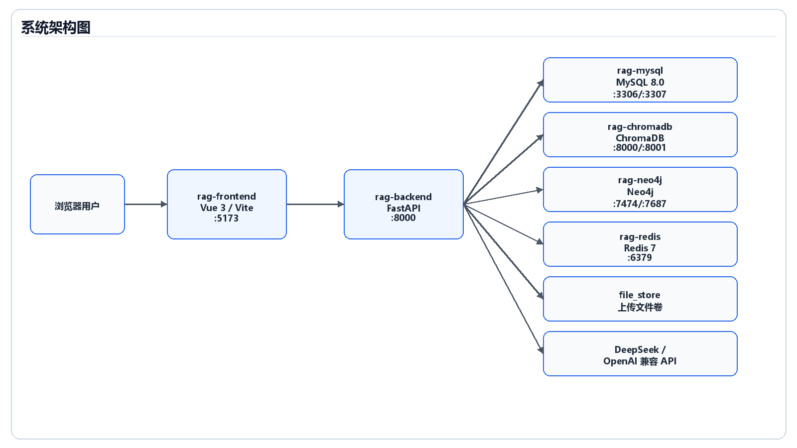
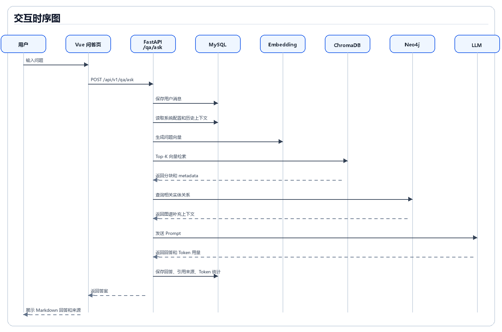
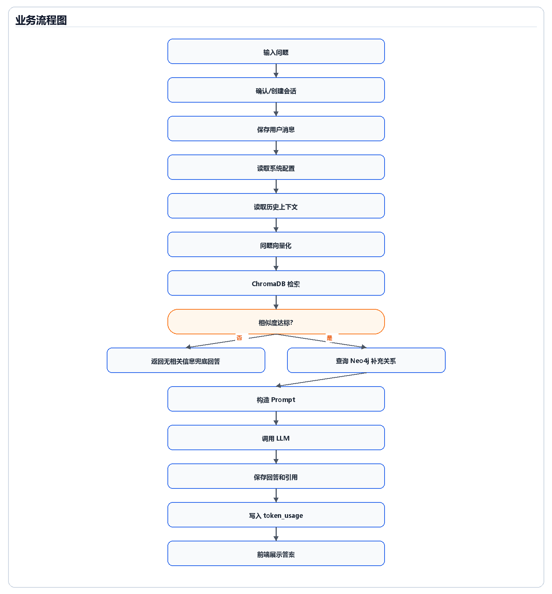
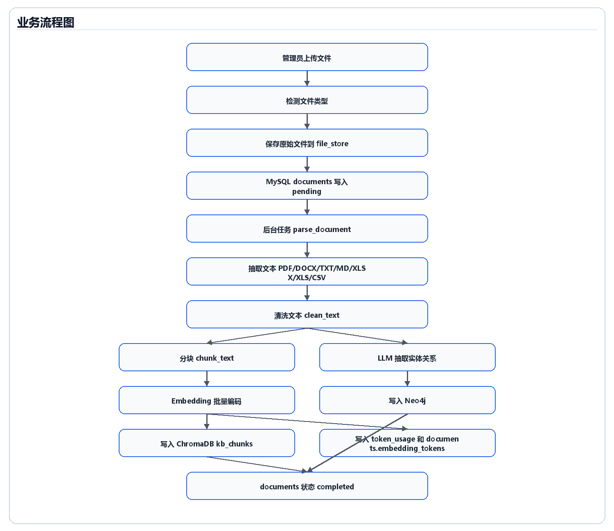
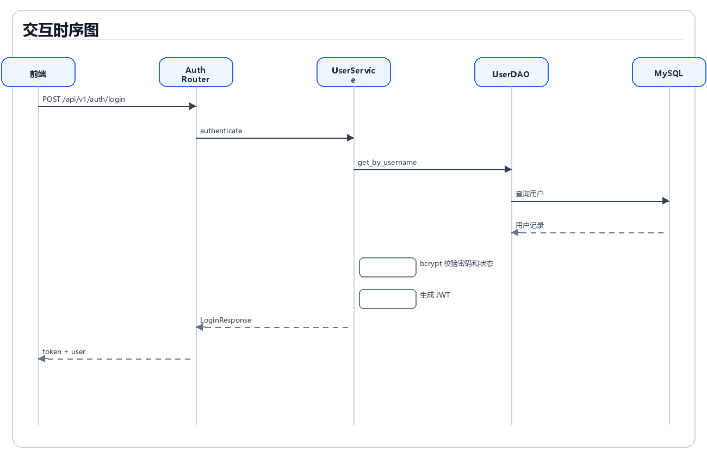
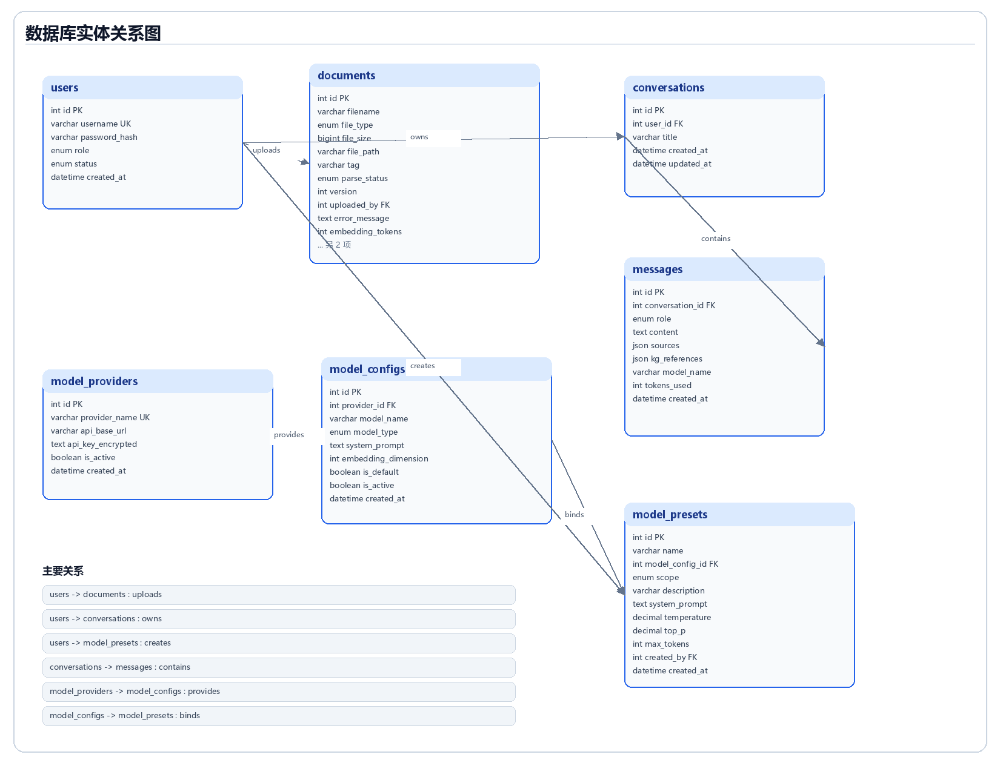
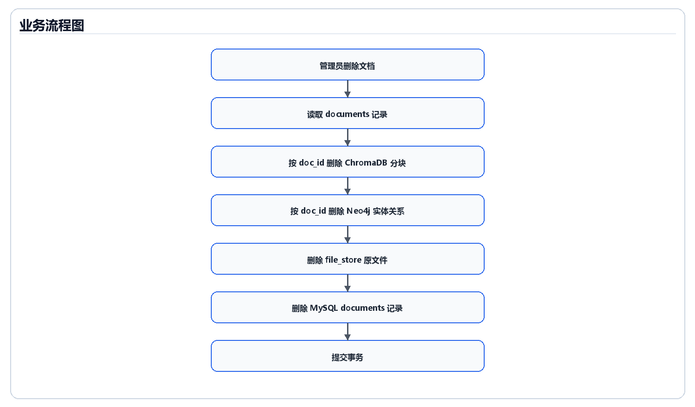

# 基于 RAG 架构的智能问答系统课程设计报告

**课程名称：** 计算系统综合课程设计  
**题目：** 基于 RAG 架构的智能问答系统  
**报告版本：** 最终版  
**完成日期：** 2026 年 6 月  
**依据文档：** `RAG-详细设计说明书-课设.md`、`RAG-数据库说明书-课设.md`

## 一、需求分析

### 1.1 项目背景

企业、课程团队或项目组在日常工作中会积累大量内部文档，例如 PDF、Word、Markdown、文本文件、表格文件和 CSV 数据。这些资料通常分散在不同目录或系统中，传统关键词检索只能匹配表面词汇，难以理解用户自然语言问题，也难以把多个文档中的实体、概念和关系组织起来。

随着大语言模型能力提升，直接把全部文档交给模型处理并不现实：一方面上下文长度有限，另一方面私有知识需要可追溯、可管理和可更新。因此，本项目采用检索增强生成（RAG）架构，先对私有文档进行解析、分块、向量化和知识图谱抽取，再在用户提问时检索相关知识并调用模型生成有出处的回答。

### 1.2 项目目标

本系统目标是实现一套可部署、可管理、可问答的私有知识库智能问答系统，主要包括：

1. 支持管理员上传和维护知识库文档。
2. 支持 PDF、DOCX、TXT、MD、XLSX、XLS、CSV 等多种文档格式。
3. 支持文档自动解析、文本清洗、分块、Embedding 向量化和向量入库。
4. 支持通过 ChromaDB 完成语义相似度检索。
5. 支持通过 Neo4j 构建知识图谱，提供实体关系补充。
6. 支持普通用户基于知识库进行多轮自然语言问答。
7. 支持答案来源溯源、图谱引用和模型 Token 用量统计。
8. 支持用户、权限、系统配置、模型供应商、模型配置和模型预设管理。
9. 支持 Docker Compose 一键部署前端、后端和数据服务。

### 1.3 用户角色

| 用户角色 | 主要职责 | 可访问模块 |
| --- | --- | --- |
| 管理员 | 管理知识库、图谱、用户、历史、配置、模型和系统状态 | 工作台、知识库、知识图谱、用户管理、全局历史、系统配置、模型管理、问答 |
| 普通用户 | 使用知识库问答、查看个人历史、维护个人资料 | 智能问答、我的历史、个人中心 |

### 1.4 功能需求

| 模块 | 功能说明 | 角色 |
| --- | --- | --- |
| M1 智能问答 | 自然语言提问、多轮会话、答案溯源、图谱增强、模型选择 | 普通用户/管理员 |
| M2 知识库管理 | 文档上传、列表查询、预览、更新、删除、批量重解析、状态追踪 | 管理员 |
| M3 知识图谱管理 | 图谱总览、实体管理、关系管理、搜索、邻居查询、手动抽取 | 管理员 |
| M4 问答历史 | 个人历史、全局历史、消息详情、历史统计 | 普通用户/管理员 |
| M5 用户与认证 | 登录、注册、当前用户、修改密码、用户维护、启用禁用 | 普通用户/管理员 |
| M6 工作台 | 用户、文档、问答、存储、趋势和服务状态统计 | 管理员 |
| M7 系统配置 | 检索参数、分块参数、模型生成参数、图谱开关 | 管理员 |
| M8 模型与 API 管理 | 供应商、模型配置、默认模型、提示词、预设、Token 用量统计 | 管理员 |

### 1.5 非功能需求

| 类别 | 要求 |
| --- | --- |
| 可用性 | 前端页面清晰，普通用户可以直接提问，管理员可以维护数据和参数 |
| 可维护性 | 后端采用 Router、Service、DAO、Model 分层，前端按 Views、API、Stores 分层 |
| 可扩展性 | 支持新增模型供应商、Chat 模型、Embedding 模型和模型预设 |
| 安全性 | JWT 认证、角色鉴权、密码哈希、API Key 加密、SQLAlchemy 参数化查询 |
| 一致性 | 删除文档时同步清理 MySQL 元数据、ChromaDB 分块、Neo4j 实体关系和本地文件 |
| 可部署性 | 使用 Docker Compose 编排 MySQL、Redis、Neo4j、ChromaDB、后端和前端 |

## 二、概要设计

### 2.1 系统总体架构

系统采用前后端分离架构。前端为 Vue 3 单页应用，负责页面展示、路由守卫、状态管理和 API 调用；后端为 FastAPI 服务，负责认证鉴权、业务流程编排、数据库访问、向量检索、图谱查询和模型调用；数据层由 MySQL、ChromaDB、Neo4j、Redis 和文件卷组成。



系统核心数据流如下：

1. 管理员上传文档，后端保存文件并写入 MySQL 文档元数据。
2. 后端解析文档文本，完成清洗、分块、Embedding 向量化。
3. 文档分块和向量写入 ChromaDB，实体关系写入 Neo4j。
4. 用户提问时，后端将问题向量化并检索 ChromaDB。
5. 若命中文档片段达到相似度阈值，则结合历史上下文和图谱关系构造 Prompt。
6. 后端调用 Chat 模型生成回答，保存回答、引用来源、图谱引用和 Token 用量。

### 2.2 技术路线

| 层级 | 技术选型 | 作用 |
| --- | --- | --- |
| 前端 | Vue 3、Vite、Vue Router、Pinia、Element Plus、Axios、ECharts、Markdown-It | 页面渲染、路由守卫、状态管理、图谱展示、Markdown 回答展示 |
| 后端 | FastAPI、SQLAlchemy Async、Pydantic、python-jose、Passlib/bcrypt、httpx | REST API、异步数据库访问、JWT、密码哈希、模型 API 调用 |
| 关系数据库 | MySQL 8.0 | 用户、文档、会话、消息、配置、模型、统计等结构化数据 |
| 向量数据库 | ChromaDB | 文档分块向量存储和语义检索 |
| 图数据库 | Neo4j | 知识实体和关系存储 |
| 缓存与任务 | Redis、Celery | 缓存、任务和运行状态扩展基础 |
| 文档解析 | pdfplumber、python-docx、openpyxl、csv | 多格式文档文本抽取 |
| 部署 | Docker、Docker Compose | 服务编排和环境隔离 |

### 2.3 后端分层架构

| 层级 | 目录 | 说明 |
| --- | --- | --- |
| 应用入口 | `docker/backend/app/main.py` | 创建 FastAPI 应用、注册 CORS、挂载路由 |
| 路由层 | `docker/backend/app/routers` | 接收 HTTP 请求、执行参数校验和权限控制 |
| 服务层 | `docker/backend/app/services` | 编排问答、文档解析、图谱、模型、用户等业务流程 |
| DAO 层 | `docker/backend/app/dao` | 封装 MySQL、ChromaDB、Neo4j 和文件存储访问 |
| 模型层 | `docker/backend/app/models` | SQLAlchemy ORM 数据模型 |
| 工具层 | `docker/backend/app/utils` | Embedding、LLM、加密、文本处理、图谱抽取、日志 |
| 任务层 | `docker/backend/app/tasks` | Celery 任务定义和后台任务扩展 |

### 2.4 前端分层架构

| 层级 | 目录 | 说明 |
| --- | --- | --- |
| 应用入口 | `docker/frontend/src/main.js`、`App.vue` | 初始化 Vue 应用 |
| 路由 | `docker/frontend/src/router/index.js` | 配置页面路由、登录守卫和角色守卫 |
| 页面 | `docker/frontend/src/views` | 登录、问答、知识库、图谱、用户、历史、模型、配置等页面 |
| 布局 | `docker/frontend/src/components/layout/Sidebar.vue` | 后台主布局和侧边导航 |
| 状态管理 | `docker/frontend/src/stores` | 认证状态和问答状态 |
| API 封装 | `docker/frontend/src/api` | Axios 客户端和各模块接口封装 |

## 三、详细设计

### 3.1 后端 API 设计

系统后端共 9 个主要路由分组：

| 分组 | 前缀 | 路由文件 | 说明 |
| --- | --- | --- | --- |
| 认证 | `/api/v1/auth` | `routers/auth.py` | 登录、注册、当前用户、修改密码、个人统计 |
| 文档管理 | `/api/v1/documents` | `routers/documents.py` | 上传、列表、预览、重解析、删除、批量操作 |
| 智能问答 | `/api/v1/qa` | `routers/qa.py` | 提问、会话、消息、可用模型 |
| 知识图谱 | `/api/v1/graph` | `routers/graph.py` | 图谱总览、实体、关系、搜索、邻居、抽取 |
| 用户管理 | `/api/v1/users` | `routers/users.py` | 用户列表、新增、编辑、重置密码、启停 |
| 问答历史 | `/api/v1/history` | `routers/history.py` | 管理员历史、个人历史、详情、统计 |
| 工作台 | `/api/v1/dashboard` | `routers/dashboard.py` | 统计、趋势、存储、系统状态 |
| 系统配置 | `/api/v1/config` | `routers/config.py` | 参数读取、批量更新、系统信息 |
| 模型管理 | `/api/v1/models` | `routers/models.py` | 供应商、模型配置、提示词、预设、用量统计 |

### 3.2 智能问答模块设计

智能问答模块是系统核心。前端页面位于 `frontend/src/views/user/QA.vue`，通过 `stores/qa.js` 保存当前会话、消息列表和加载状态，通过 `api/qa.js` 调用后端接口。后端由 `routers/qa.py` 接收请求，核心业务逻辑由 `services/qa_service.py` 的 `rag_pipeline` 完成。



问答流程包括：

1. 用户在前端输入问题。
2. 前端调用 `POST /api/v1/qa/ask`。
3. 后端保存用户消息到 `messages`。
4. 后端读取系统配置和最近多轮历史。
5. 后端调用 Embedding 模型生成问题向量。
6. 后端调用 ChromaDB 检索 Top-K 文档分块。
7. 系统按相似度阈值过滤低相关分块。
8. 若没有有效命中，返回兜底回答，避免无依据生成。
9. 若启用知识图谱，后端查询 Neo4j 相关实体关系。
10. 系统拼接参考资料、图谱信息、历史上下文和系统提示词。
11. 后端调用 LLM 生成答案。
12. 系统保存答案、引用来源、图谱引用和 Token 使用量。



### 3.3 知识库管理模块设计

知识库管理模块支持管理员对文档进行上传、查询、预览、更新、删除、重解析和批量操作。文档服务由 `services/document_service.py` 实现，数据访问涉及 `document_dao.py`、`file_store.py`、`chroma_repo.py`、`neo4j_repo.py` 和 `token_usage_dao.py`。



文档入库设计如下：

1. 检测上传文件扩展名，确认是否支持。
2. 将原始文件保存到 Docker volume `file_store`。
3. 在 MySQL `documents` 表中写入元数据，状态为 `pending`。
4. 后台任务将状态更新为 `parsing`。
5. 根据文件类型抽取文本：
   - PDF 使用 `pdfplumber`；
   - DOCX 使用 `python-docx`；
   - TXT/MD 使用文本读取；
   - XLSX/XLS 使用 `openpyxl`；
   - CSV 使用 `csv.reader`。
6. 对文本进行清洗，去除空字符、重复空格和过多换行。
7. 调用 `chunk_text` 分块，默认分块大小 512 字符，重叠 128 字符。
8. 使用默认 Embedding 模型批量生成向量。
9. 向量、分块文本和元数据写入 ChromaDB 的 `kb_chunks` Collection。
10. 将 Embedding Token 消耗写入 `token_usage`，同时更新 `documents.embedding_tokens`。
11. 调用 LLM 抽取实体关系并写入 Neo4j。
12. 文档状态更新为 `completed`；若失败则更新为 `failed` 并保存错误信息。

### 3.4 知识图谱模块设计

知识图谱模块由 `views/admin/Graph.vue`、`api/graph.js`、`routers/graph.py`、`services/kg_service.py` 和 `dao/neo4j_repo.py` 组成。系统使用 Neo4j 保存 `Entity` 节点和实体关系，节点包含实体名称、类型、描述和来源文档 ID。

知识图谱主要用途包括：

- 在管理端展示图谱总览；
- 支持实体新增、编辑、删除；
- 支持关系新增、删除；
- 支持实体搜索、类型筛选和邻居查询；
- 在 RAG 问答中作为补充上下文，提高回答关联性；
- 删除文档时根据 `doc_id` 清理图谱数据。

### 3.5 用户与权限模块设计

认证模块使用 JWT Token。用户登录时，后端按用户名查询 `users` 表，使用 bcrypt 校验密码哈希，校验通过后生成 JWT。前端把 Token 和用户信息保存在 `localStorage` 中，并通过 Vue Router 路由守卫控制访问。

认证和授权设计包括：

| 设计点 | 实现方式 |
| --- | --- |
| 登录认证 | `POST /api/v1/auth/login`，返回 Token 和用户信息 |
| 注册 | `POST /api/v1/auth/register` |
| 当前用户 | `GET /api/v1/auth/me` |
| 管理员权限 | 后端依赖 `require_admin`，前端路由设置 `meta.role='admin'` |
| 普通用户权限 | 只能访问自己的会话、消息和个人历史 |
| 密码安全 | bcrypt 哈希保存 |
| Token 签名 | JWT `HS256` |



### 3.6 系统配置与模型管理设计

系统配置表 `system_config` 保存 RAG 和模型运行参数：

| 配置键 | 默认值 | 用途 |
| --- | --- | --- |
| `temperature` | `0.7` | LLM 温度参数 |
| `top_p` | `0.9` | LLM Top-P 参数 |
| `max_tokens` | `2048` | 最大输出 Token |
| `top_k` | `5` | ChromaDB 检索返回数量 |
| `similarity_threshold` | `0.6` | 相似度阈值 |
| `chunk_size` | `512` | 文本分块大小 |
| `chunk_overlap` | `128` | 文本分块重叠长度 |
| `kg_enabled` | `true` | 是否启用知识图谱增强 |
| `history_rounds` | `5` | 多轮对话历史轮数 |

模型管理模块维护模型供应商、Chat 模型、Embedding 模型、系统提示词、默认模型和模型预设。模型供应商 API Key 使用加密方式保存到 `model_providers.api_key_encrypted`，后端调用模型时再解密使用。系统还通过 `token_usage` 表统计 Chat 和 Embedding 消耗，为模型成本分析提供依据。

## 四、数据库设计

### 4.1 数据库总体设计

系统采用“关系型数据库 + 向量数据库 + 图数据库 + 缓存 + 文件存储”的组合数据架构。

| 存储组件 | 服务名 | 主要职责 |
| --- | --- | --- |
| MySQL | `rag-mysql` | 用户、文档、会话、消息、配置、模型和 Token 统计 |
| ChromaDB | `rag-chromadb` | 文档分块向量、分块文本和向量检索元数据 |
| Neo4j | `rag-neo4j` | 知识实体、实体关系和图谱可视化 |
| Redis | `rag-redis` | 缓存、任务和运行状态扩展 |
| 文件卷 | `file_store` | 上传原始文件 |

### 4.2 MySQL 表设计

最终 MySQL 数据库共 9 张核心表：

| 表名 | 中文名称 | 主要用途 |
| --- | --- | --- |
| `users` | 用户表 | 登录认证、角色权限、账号状态 |
| `documents` | 文档元数据表 | 上传文件、解析状态、标签、版本、Embedding Token |
| `conversations` | 会话表 | 记录用户问答会话 |
| `messages` | 消息表 | 记录提问、回答、来源、图谱引用和模型用量 |
| `system_config` | 系统配置表 | 保存 RAG、LLM、分块和图谱参数 |
| `model_providers` | 模型供应商表 | 保存供应商地址和加密 API Key |
| `model_configs` | 模型配置表 | 保存 Chat/Embedding 模型和默认模型 |
| `model_presets` | 模型预设表 | 保存提示词和生成参数组合 |
| `token_usage` | Token 使用记录表 | 独立统计问答和文档向量化 Token 消耗 |



### 4.3 关键数据表说明

`users` 表保存用户基础信息，包括用户名、密码哈希、角色、状态和创建时间。`documents` 表保存文档元数据，包括文件名、文件类型、文件大小、文件路径、分类标签、解析状态、版本、上传人、错误信息和向量化消耗。`conversations` 和 `messages` 分别保存会话与消息，消息表中的 `sources` 和 `kg_references` 使用 JSON 字段保存回答来源和图谱引用。

模型相关表包括 `model_providers`、`model_configs` 和 `model_presets`。供应商表保存 OpenAI 兼容 API 地址和加密 API Key，模型配置表区分 `chat` 与 `embedding` 两种类型，模型预设表保存可复用的提示词和生成参数。`token_usage` 表独立记录消耗，不设置级联删除，以保证统计数据不因源会话或文档删除而丢失。

### 4.4 外部存储设计

ChromaDB Collection 名称为 `kb_chunks`，每个分块 ID 采用 `doc{doc_id}_chunk{chunk_index}` 格式，元数据包含 `doc_id`、`filename` 和 `chunk_index`。用户提问时系统检索该 Collection，返回相似分块并写入回答来源。

Neo4j 主要节点类型为 `Entity`，节点属性包括 `name`、`type`、`description` 和 `doc_id`。实体关系由 LLM 从文档内容中抽取，管理端可以进行图谱查看、搜索和维护。文档删除时，系统按 `doc_id` 删除对应图谱数据。

## 五、系统实现与结果分析

### 5.1 开发实现过程

系统实现按照“基础架构搭建、数据库初始化、后端模块开发、前端页面开发、RAG 流程集成、图谱增强、模型管理和部署验证”的顺序推进。后端先完成 FastAPI 应用入口、数据库连接和模型定义，再逐步实现用户认证、文档管理、问答、图谱、历史、工作台、系统配置和模型管理。前端先完成登录、路由和布局，再实现管理员页面与用户问答页面。

### 5.2 核心算法与业务逻辑

#### 5.2.1 文档分块算法

文档文本经过清洗后调用 `chunk_text` 进行分块。默认分块大小为 512 字符，重叠长度为 128 字符。若分块边界附近存在句号或换行，则尽量在自然边界切分，降低语义被截断的概率。

伪代码如下：

```text
输入：文档文本 text，分块大小 chunk_size，重叠长度 chunk_overlap
输出：文本块列表 chunks

if text 长度 <= chunk_size:
    返回 [text]

start = 0
while start < len(text):
    end = start + chunk_size
    chunk = text[start:end]
    if end 未到文本结尾:
        寻找 chunk 内最后一个句号或换行
        如果位置超过 chunk_size 的一半，则在该位置截断
    保存非空 chunk
    start = end - chunk_overlap
```

#### 5.2.2 RAG 问答算法

RAG 问答流程先进行向量检索，再构造 Prompt 调用 LLM。系统设置相似度阈值，当检索结果低于阈值时返回兜底回答，避免模型编造无依据内容。

```text
输入：用户问题 question，会话 conversation_id，模型 model_name
输出：模型回答 answer、引用 sources、图谱引用 kg_references

保存用户消息
读取系统配置和历史上下文
question_embedding = Embedding(question)
results = ChromaDB.query(question_embedding, top_k)
sources = 按 similarity_threshold 过滤 results
if sources 为空:
    返回“知识库中暂无相关信息”
if kg_enabled:
    kg_context = Neo4j.query_subgraph(question_terms)
prompt = system_prompt + sources + history + kg_context + question
answer = LLM.chat(prompt)
保存回答、来源、图谱引用和 token_usage
返回 answer
```

### 5.3 系统实现结果

系统最终实现了完整的前后端功能闭环：

| 功能 | 实现结果 |
| --- | --- |
| 登录认证 | 支持登录、注册、当前用户、修改密码、用户名更新 |
| 角色权限 | 支持管理员和普通用户权限隔离 |
| 知识库管理 | 支持文档上传、列表、预览、更新、删除、重解析和批量操作 |
| 文档解析 | 支持 PDF、DOCX、TXT、MD、XLSX、XLS、CSV |
| 向量检索 | 支持 ChromaDB 分块向量写入和 Top-K 检索 |
| 智能问答 | 支持多轮会话、答案生成、低相关度兜底、引用来源 |
| 知识图谱 | 支持实体关系抽取、图谱总览、搜索、实体和关系维护 |
| 历史记录 | 支持个人历史和管理员全局历史 |
| 工作台 | 支持统计、趋势、存储和系统状态 |
| 系统配置 | 支持 RAG 和模型参数在线配置 |
| 模型管理 | 支持供应商、模型、默认模型、提示词、预设和用量统计 |
| 部署 | 支持 Docker Compose 一键启动 |

### 5.4 数据一致性处理

文档删除流程涉及多个存储系统。为了保证数据一致性，系统按以下顺序清理数据：



1. 查询 MySQL `documents` 记录。
2. 按 `doc_id` 删除 ChromaDB 中对应分块。
3. 按 `doc_id` 删除 Neo4j 中对应实体和关系。
4. 删除文件卷中的原始文件。
5. 删除 MySQL 中的文档元数据。
6. 提交数据库事务。

## 六、部署、测试与运行

### 6.1 部署环境

系统使用 Docker Compose 编排服务：

| 服务 | 说明 |
| --- | --- |
| `rag-mysql` | MySQL 数据库，启动时执行 `mysql/init.sql` |
| `rag-redis` | Redis 缓存服务 |
| `rag-neo4j` | Neo4j 图数据库 |
| `rag-chromadb` | ChromaDB 向量数据库 |
| `rag-backend` | FastAPI 后端服务 |
| `rag-frontend` | Vue 前端服务 |

启动命令：

```bash
cd docker
docker compose up -d
```

### 6.2 访问地址

| 服务 | 地址 |
| --- | --- |
| 前端页面 | `http://localhost:5173` |
| 后端 API | `http://localhost:8000` |
| Swagger API 文档 | `http://localhost:8000/docs` |
| 健康检查 | `http://localhost:8000/health` |
| Neo4j 控制台 | `http://localhost:7474` |
| ChromaDB | `http://localhost:8001` |

默认管理员账号：

| 用户名 | 密码 | 角色 |
| --- | --- | --- |
| `admin` | `admin123` | 管理员 |

### 6.3 测试要点

| 测试项 | 测试内容 | 预期结果 |
| --- | --- | --- |
| 登录认证 | 使用管理员账号登录 | 返回 Token，进入工作台 |
| 路由权限 | 普通用户访问管理员页面 | 自动跳转到问答页或被后端拒绝 |
| 文档上传 | 上传 PDF、DOCX、TXT、MD、XLSX、CSV 文件 | 写入文档记录并进入解析流程 |
| 文档解析 | 查看文档状态 | 状态从 `pending` 到 `parsing` 再到 `completed` |
| 向量检索 | 对已入库内容提问 | 返回相关答案和引用来源 |
| 低相关问题 | 提问知识库无关问题 | 返回兜底提示 |
| 图谱管理 | 搜索实体、查看邻居、新增关系 | Neo4j 数据正常读写 |
| 模型管理 | 新增供应商、测试连接、设置默认模型 | 模型配置生效 |
| Token 统计 | 进行问答和文档解析 | `token_usage` 记录消耗 |
| 文档删除 | 删除已解析文档 | MySQL、ChromaDB、Neo4j 和文件卷同步清理 |

## 七、安全设计与异常处理

### 7.1 安全设计

系统安全设计包括：

- 使用 JWT 进行登录态认证。
- 管理接口统一使用管理员权限依赖。
- 前端路由守卫限制未登录访问和越权访问。
- 用户密码使用 bcrypt 哈希保存。
- 模型 API Key 使用 AES 加密后入库。
- 数据库访问使用 SQLAlchemy，避免拼接 SQL。
- 文件上传限制扩展名，文件路径由后端生成。

### 7.2 异常处理

| 场景 | 处理方式 |
| --- | --- |
| 登录失败 | 返回认证失败信息，不签发 Token |
| 用户禁用 | 拒绝登录或继续访问 |
| 文档类型不支持 | 返回不支持的文件类型错误 |
| 文档解析失败 | `documents.parse_status` 更新为 `failed`，保存错误信息 |
| 向量检索无命中 | 返回兜底回答，不调用模型生成无依据答案 |
| 图谱查询失败 | 捕获异常，不影响主问答流程 |
| ChromaDB 删除失败 | 记录日志，继续处理其他删除步骤 |
| Neo4j 删除失败 | 记录日志，继续处理 MySQL 和文件删除 |
| 模型供应商不可用 | 连通性测试或调用阶段返回失败 |

## 八、总结与思考

本课程设计完成了一套基于 RAG 架构的智能问答系统。系统以 MySQL 管理结构化业务数据，以 ChromaDB 管理文档分块向量，以 Neo4j 管理知识实体和关系，以 FastAPI 和 Vue 3 实现前后端分离应用。系统最终实现了文档管理、智能问答、知识图谱、用户权限、历史记录、工作台、系统配置和模型管理等核心功能，形成了从文档入库到问答生成再到来源追踪的完整闭环。

本项目的主要收获包括：

1. 理解并实现了 RAG 系统的核心流程，包括文档解析、分块、向量化、检索、Prompt 构造和模型调用。
2. 掌握了多存储系统协同设计方法，将 MySQL、ChromaDB、Neo4j、Redis 和文件存储按职责拆分。
3. 理解了后端分层架构的重要性，通过 Router、Service、DAO、Model 分层降低模块耦合。
4. 学习了前端权限控制、状态管理和 API 封装方式。
5. 认识到生成式 AI 系统需要重视答案依据、低相关度兜底、安全认证和数据一致性。

后续可改进方向包括：

- 增加更完善的异步任务状态展示；
- 支持更多文档格式和 OCR；
- 优化知识图谱抽取准确率；
- 增加检索结果重排序；
- 支持更细粒度的用户权限和知识库权限；
- 引入自动化测试和持续集成；
- 增加对模型调用成本的可视化分析。

## 九、附录

### 9.1 主要源程序文件清单

| 模块 | 前端文件 | 后端文件 |
| --- | --- | --- |
| 登录认证 | `views/Login.vue`、`stores/auth.js`、`api/auth.js` | `routers/auth.py`、`services/user_service.py` |
| 智能问答 | `views/user/QA.vue`、`stores/qa.js`、`api/qa.js` | `routers/qa.py`、`services/qa_service.py` |
| 知识库 | `views/admin/Knowledge.vue`、`api/documents.js` | `routers/documents.py`、`services/document_service.py` |
| 图谱 | `views/admin/Graph.vue`、`api/graph.js` | `routers/graph.py`、`services/kg_service.py`、`dao/neo4j_repo.py` |
| 用户 | `views/admin/Users.vue`、`api/users.js` | `routers/users.py`、`services/user_service.py` |
| 历史 | `views/admin/History.vue`、`views/user/MyHistory.vue`、`api/history.js` | `routers/history.py`、`services/history_service.py` |
| 工作台 | `views/admin/Dashboard.vue`、`api/dashboard.js` | `routers/dashboard.py`、`services/dashboard_service.py` |
| 配置 | `views/admin/Config.vue`、`api/config.js` | `routers/config.py`、`services/config_service.py` |
| 模型 | `views/admin/Model.vue`、`api/models.js` | `routers/models.py`、`services/model_service.py` |

### 9.2 数据库表清单

| 表名 | 说明 |
| --- | --- |
| `users` | 用户和权限 |
| `documents` | 文档元数据和解析状态 |
| `conversations` | 问答会话 |
| `messages` | 问答消息、来源和图谱引用 |
| `system_config` | 系统运行配置 |
| `model_providers` | 模型供应商和加密 API Key |
| `model_configs` | Chat/Embedding 模型配置 |
| `model_presets` | 模型预设 |
| `token_usage` | Token 消耗统计 |

### 9.3 参考文档

- `RAG-详细设计说明书-课设.md`
- `RAG-数据库说明书-课设.md`
- `docker/docker-compose.yml`
- `docker/mysql/init.sql`
- `docker/backend/app`
- `docker/frontend/src`
