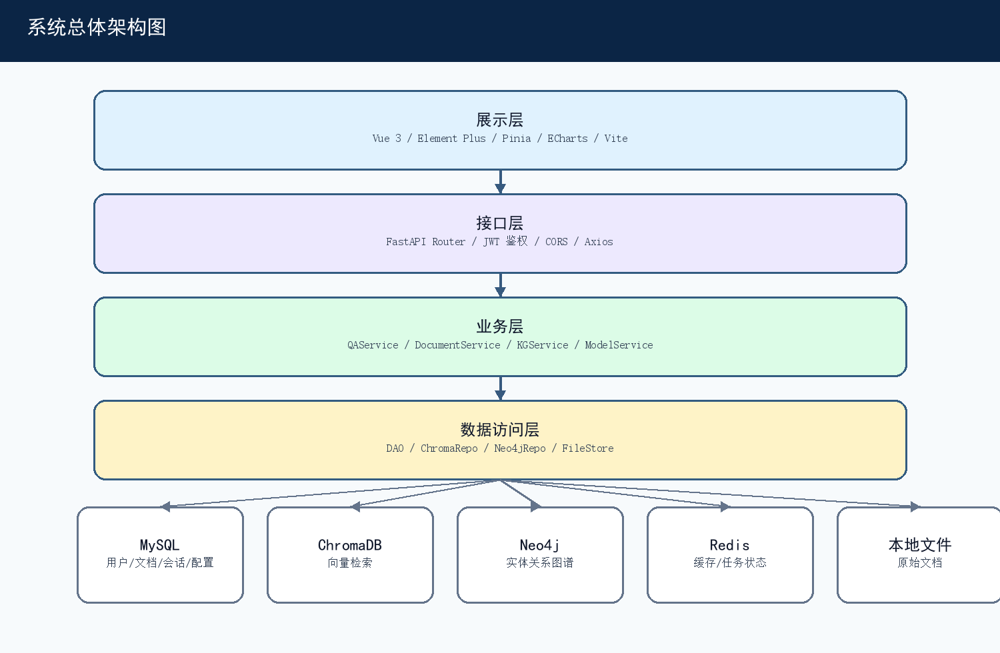
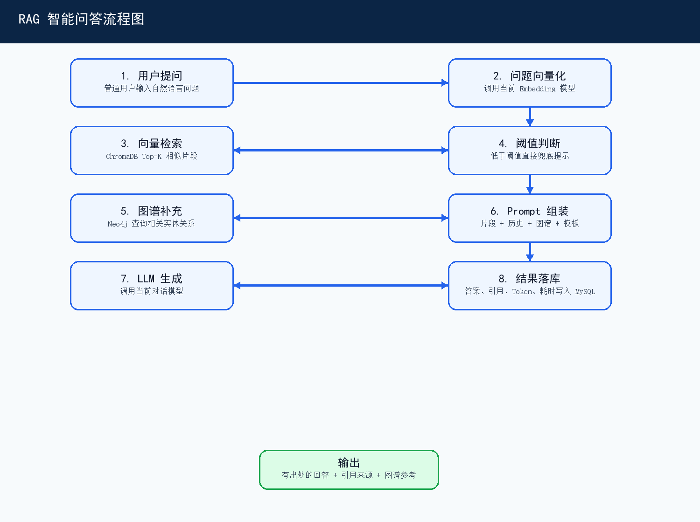
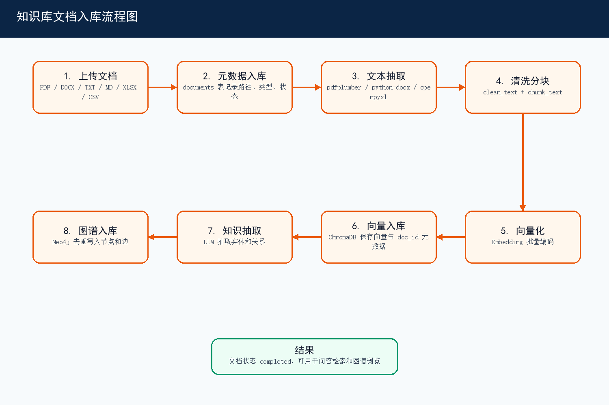
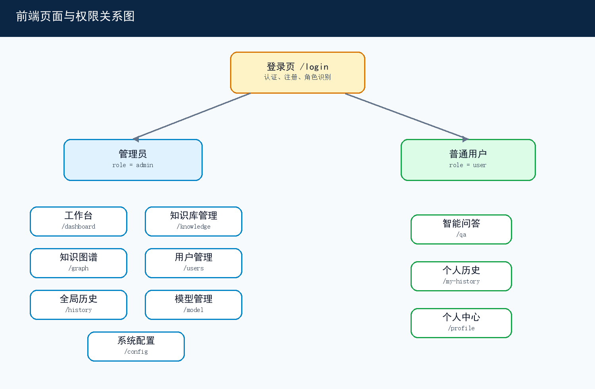
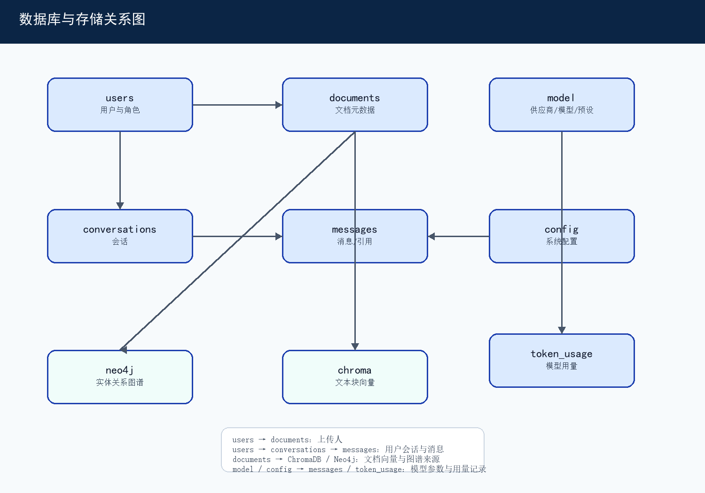

# 基于 RAG 架构的智能问答系统课程设计报告

**课程名称：** 计算系统综合课程设计  
**题目：** 基于 RAG 架构的智能问答系统  
**姓名：** 栗姜涛  
**完成日期：** 2026 年 6 月

## 一、需求分析

### 1.1 问题描述

本项目面向企业内部知识检索与问答场景，设计并实现一套基于检索增强生成（RAG）的私有知识库智能问答系统。企业日常知识通常散落在 PDF、Word、文本、表格等资料中，传统关键词检索难以理解语义，也难以把跨文档的实体关系组织起来。系统需要支持管理员导入内部文档，自动完成解析、清洗、分块、向量化和知识图谱构建，并允许普通用户通过自然语言提问获得有依据、有出处的回答。

项目目标包括：支持知识库文档管理；支持多轮智能问答和答案溯源；通过 ChromaDB 完成语义检索；通过 Neo4j 补充实体关系；支持模型供应商、对话模型、Embedding 模型和 Prompt 模板配置；支持管理员进行用户、历史、配置、模型、图谱和工作台管理。

### 1.2 总体描述

系统用户分为管理员和普通用户。管理员负责知识库、知识图谱、用户、全局问答历史、工作台、系统配置和模型 API 管理；普通用户使用智能问答、查看个人历史和个人中心。系统采用前后端分离架构，前端为 Vue 3 单页应用，后端为 FastAPI RESTful API，数据层由 MySQL、ChromaDB、Neo4j、Redis 和本地文件存储组成。



图2-1 系统总体架构图

### 1.3 功能需求

| 模块 | 功能说明 | 角色 |
|---|---|---|
| M1 智能问答 | 自然语言提问、多轮对话、答案溯源、会话管理、用户模型选择 | 普通用户 |
| M2 知识库管理 | 文档上传、解析状态追踪、列表、更新、预览、删除、分类 | 管理员 |
| M3 知识图谱管理 | 图谱可视化、实体管理、关系管理、图谱搜索、手动补充 | 管理员 |
| M4 问答历史 | 个人历史、全局历史、问答详情、问答统计 | 管理员/普通用户 |
| M5 用户管理 | 登录、注册、用户维护、启用禁用、个人中心 | 管理员/普通用户 |
| M6 工作台 | 文档统计、问答趋势、模型用量、服务状态 | 管理员 |
| M7 系统配置 | 检索参数、分块策略、模型参数、知识图谱开关 | 管理员 |
| M8 模型与 API 管理 | 供应商配置、模型配置、连通性测试、默认模型、模型预设 | 管理员 |

### 1.4 性能、安全与非功能需求

系统需要在检索、模型调用和数据写入之间保持稳定性。问答流程应支持 Top-K 检索、相似度阈值判断和低相关度兜底提示，避免在知识库无依据时调用大模型生成不可靠答案。文档删除或更新时，需要同步清理 MySQL 元数据、ChromaDB 向量、Neo4j 图谱和本地文件，保证数据一致性。

安全方面，系统采用 JWT 认证、角色鉴权和前端路由守卫；密码使用 bcrypt 加盐哈希；模型 API Key 使用 AES-256-CBC 加密存储；后端使用 SQLAlchemy 参数化查询防止 SQL 注入；前端通过 Vue 模板转义和 Axios 拦截器降低 XSS 与越权访问风险。

## 二、概要设计

### 2.1 系统架构

系统采用五层架构：展示层、接口层、业务服务层、数据访问层和数据存储层。展示层负责页面渲染、状态管理、图谱展示和用户交互；接口层负责 HTTP API、鉴权和跨域；业务层组织问答、文档、图谱、模型、用户和配置流程；数据访问层封装 MySQL DAO、ChromaDB Repository、Neo4j Repository 和文件存储；数据层分别存储结构化数据、向量数据、图数据、缓存和原始文件。

### 2.2 技术路线

| 层级 | 技术选型 | 说明 |
|---|---|---|
| 前端 | Vue 3、Element Plus、Pinia、Vue Router、Axios、ECharts、Vite | 后台 SPA、状态管理、路由守卫、图谱展示 |
| 后端 | Python 3.11、FastAPI、SQLAlchemy、Pydantic、httpx | RESTful API、异步数据库访问、模型调用 |
| 关系数据库 | MySQL 8.0 | 用户、文档、会话、消息、配置、模型、用量统计 |
| 向量数据库 | ChromaDB | 文档文本块向量与语义相似度检索 |
| 图数据库 | Neo4j | 实体、关系、文档来源和图谱可视化 |
| 缓存与任务 | Redis、Celery | 任务状态、缓存、限流、异步解析 |
| 部署 | Docker、Docker Compose | 统一编排前端、后端和数据服务 |

### 2.3 核心处理流程

文档入库流程从管理员上传文件开始，系统识别文件类型并保存文件，写入 documents 元数据表，随后异步抽取文本、清洗、分块、向量化并写入 ChromaDB，同时调用 LLM 抽取实体和关系写入 Neo4j。问答流程从用户提问开始，系统保存用户消息，读取会话历史和系统配置，将问题向量化后检索 ChromaDB，达到阈值后拼接上下文、图谱信息和 Prompt 调用 LLM，最后保存答案、引用和模型用量。



图2-2 RAG 智能问答流程图



图2-3 知识库文档入库流程图

### 2.4 运行环境

系统推荐使用 Docker Compose 启动。前端服务端口为 5173，后端 API 端口为 8000，MySQL 映射为 3307:3306，Redis 使用 6379，Neo4j 使用 7474/7687，ChromaDB 映射为 8001:8000。硬件建议至少 4 核 CPU、8GB 内存和 20GB 磁盘，推荐 8 核 CPU、16GB 内存和 SSD，以满足文档解析、向量检索和模型调用并发需求。

## 三、详细设计

### 3.1 系统功能视图

M1 智能问答模块处于业务核心位置，M2 知识库管理负责构建可检索知识，M3 知识图谱提供关联知识补充，M4 记录问答历史，M5 提供认证和角色控制，M6 汇总系统状态，M7 提供运行参数，M8 提供模型供应商、模型配置和模型预设。模块间通过 FastAPI 路由、Service 类、DAO 类和统一数据库会话协作。



图3-1 前端页面与权限关系图

### 3.2 数据视图

关系数据库以 MySQL 为主，核心表包括 users、documents、conversations、messages、system_config、model_providers、model_configs、model_presets 和 token_usage。非结构化数据分布在本地文件存储、ChromaDB 和 Neo4j 中：本地文件保存原始上传材料；ChromaDB 保存文本块向量和 doc_id、filename、chunk_index 元数据；Neo4j 保存 Entity 节点及实体关系边。



图3-2 数据库与存储关系图

| 数据对象 | 存储位置 | 设计说明 |
|---|---|---|
| 用户与权限 | MySQL users | 保存用户名、密码哈希、角色、状态和创建时间 |
| 文档元数据 | MySQL documents | 保存文件名、类型、路径、标签、解析状态、版本、上传人 |
| 会话与消息 | MySQL conversations / messages | 保存会话、用户消息、机器人回答、引用来源、图谱引用 |
| 模型配置 | MySQL model_providers / model_configs / model_presets | 保存供应商、API Key 密文、模型类型、Prompt、默认模型 |
| 模型用量 | MySQL token_usage | 保存对话和 Embedding 的 Token 消耗 |
| 向量数据 | ChromaDB | 保存文本块向量和检索元数据 |
| 图谱数据 | Neo4j | 保存实体、关系和文档来源 |
| 缓存任务 | Redis | 保存任务状态、缓存和限流计数 |

### 3.3 智能问答模块详细设计

前端问答页面由 views/user/QA.vue 承载，ConvList.vue 显示会话列表，ChatBubble.vue 显示聊天气泡，SourceCard.vue 展示引用来源，Pinia 的 qa.js 维护当前会话、消息列表、所选模型和加载状态。后端 routers/qa.py 接收会话创建、发送问题、查询消息、删除会话等请求，services/qa_service.py 的 rag_pipeline 实现核心链路。

rag_pipeline 的处理过程为：读取 top_k、similarity_threshold、history_rounds、kg_enabled 等系统配置；保存用户消息；获取最近多轮对话历史；调用 EmbeddingClient 编码问题；调用 chroma_repo.query 检索相似文本块；按阈值筛选 sources；低于阈值时直接返回兜底提示；启用图谱时从 Neo4j 查询相关子图；组装 Prompt；调用 LLMClient 生成回答；保存机器人消息并记录 token_usage。

### 3.4 知识库与知识图谱模块详细设计

知识库管理模块由 views/admin/Knowledge.vue、DocTable.vue、UploadDialog.vue、DocPreview.vue 和后端 documents 路由组成。DocumentService 负责文件上传、文件类型检测、元数据保存、文本抽取、文本清洗、分块、向量化、ChromaDB 入库、知识图谱抽取和删除时级联清理。系统支持 PDF、DOCX、TXT、MD、XLSX、XLS 和 CSV。

知识图谱模块通过 kg_extractor.py 调用 LLM 抽取 entities 和 relations，并对返回 JSON 做正则提取、尾随逗号修复、缺失逗号修复和数组级兜底解析。抽取结果按实体名称和 source|relation|target 组合键去重，分别写入 Neo4j 节点和关系。前端 Graph 页面通过 ECharts 展示图谱，并提供实体管理、关系管理、搜索和手动补充能力。

### 3.5 用户、配置和模型模块详细设计

用户管理模块提供登录、注册、用户列表、新增、编辑、启用禁用和个人中心功能。前端路由守卫从 localStorage 读取 token 和 user 信息，无 token 时跳转登录页，访问管理员页面时校验 role。系统配置模块维护 temperature、top_p、max_tokens、top_k、similarity_threshold、chunk_size、chunk_overlap、kg_enabled、history_rounds 等参数。模型管理模块维护供应商、模型、Prompt、默认模型、连通性测试和模型预设，并支持 Embedding 模型切换后的向量重建。

## 四、系统实现及结果分析

### 4.1 系统详细实现过程

项目源码按 docker 目录组织。docker-compose.yml 编排 MySQL、Redis、Neo4j、ChromaDB、后端和前端服务；backend/app/main.py 创建 FastAPI 应用并注册路由；backend/app/database.py 建立异步数据库会话；backend/app/routers 提供各模块 API；backend/app/services 组织业务逻辑；backend/app/dao 封装 MySQL、ChromaDB、Neo4j 和文件存储；backend/app/utils 封装 Embedding、LLM、加密、日志、文本处理和知识图谱抽取；frontend/src/views、api、stores、router、components 分别负责页面、接口、状态、路由和组件。

### 4.2 核心算法实现

RAG 问答的关键是“先检索、再生成、可溯源”。系统将问题向量化后检索 ChromaDB，并把 ChromaDB 返回的距离转换为相似度。如果最高相似度低于阈值，系统直接提示知识库暂无相关信息，不调用 LLM；如果达到阈值，则把文档片段、知识图谱补充、会话历史、模型 Prompt 和用户问题组合后发给 LLM，返回答案和引用来源。

文档解析的关键是“按格式抽取、按配置分块、同步多库”。PDF 使用 pdfplumber，DOCX 使用 python-docx，Excel 使用 openpyxl，文本类文件直接读取。文本经过清洗和分块后批量编码为向量，写入 ChromaDB；同时分段抽取实体关系写入 Neo4j。文档删除或更新时，系统同步清理旧向量、旧图谱、本地文件和元数据。

### 4.3 用户界面实现

前端界面采用经典后台布局。管理员页面包括工作台、知识库管理、知识图谱、用户管理、全局问答历史、模型与 API 管理、系统配置；普通用户页面包括智能问答、个人历史和个人中心。页面通过 Axios 调用后端 API，通过 Pinia 管理认证状态和问答会话状态，通过 ECharts 绘制知识图谱可视化。

### 4.4 实现结果分析

| 模块 | 实现结果 | 分析 |
|---|---|---|
| 智能问答 | 完成会话、提问、RAG 检索、答案生成、引用、兜底提示、Token 统计 | 能减少无依据回答，支持多轮问答和来源追踪 |
| 知识库管理 | 完成上传、解析、分块、向量入库、状态追踪、预览、更新、删除 | 文档生命周期与向量/图谱数据同步 |
| 知识图谱 | 完成实体关系抽取、Neo4j 入库、子图查询和前端可视化 | 提高关联知识展示能力，但抽取质量依赖模型 |
| 用户与权限 | 完成登录、注册、角色控制、用户维护 | 满足管理员和普通用户分权需求 |
| 模型与配置 | 完成供应商、模型、Prompt、参数、预设和用量管理 | 支持模型切换和参数动态调整 |
| 部署运行 | 完成 Docker Compose 编排和数据库初始化 | 便于复现课程设计运行环境 |

## 五、总结与思考

本次课程设计完成了基于 RAG 架构的智能问答系统，从需求分析、概要设计、详细设计到核心功能实现，覆盖了前端页面、后端接口、关系数据库、向量数据库、图数据库、缓存和模型调用。通过该项目，进一步理解了 RAG 系统“知识导入—语义检索—上下文组装—模型生成—答案溯源”的完整链路，也掌握了多数据库协同、前后端分离、Docker 编排和模型配置化管理的方法。

开发过程中主要问题包括：文档格式多样导致抽取方式不同；模型输出 JSON 不稳定影响图谱抽取；Embedding 模型切换可能导致向量维度不兼容；问答过程既要保证准确性又要控制模型调用成本；文档更新删除需要同步清理多个存储系统。对应解决方案包括：按文件类型封装抽取逻辑；对 LLM JSON 输出进行容错解析；通过系统配置和重建任务处理向量重建；设置相似度阈值和兜底提示；在 DocumentService 中集中处理级联清理。

后续改进方向包括：补充自动化测试和压力测试；增加真实运行截图和演示数据；优化长文档分块策略；改进知识图谱抽取质量评估；增加模型调用失败重试和熔断机制；完善权限粒度和审计日志。

## 六、附录：源程序文件清单及代码

### 6.1 主要源程序文件清单

| 类别 | 文件或目录 | 说明 |
|---|---|---|
| 部署 | docker/docker-compose.yml | 编排 MySQL、Redis、Neo4j、ChromaDB、后端和前端 |
| 数据库 | docker/mysql/init.sql | 初始化核心表、索引和预置数据 |
| 后端入口 | docker/backend/app/main.py | 创建 FastAPI 应用并注册路由 |
| 数据库连接 | docker/backend/app/database.py | 创建异步 SQLAlchemy 会话 |
| 路由层 | docker/backend/app/routers/*.py | 认证、文档、问答、图谱、用户、历史、工作台、配置、模型接口 |
| 服务层 | docker/backend/app/services/*.py | 业务流程实现 |
| 数据访问层 | docker/backend/app/dao/*.py | MySQL CRUD、ChromaDB、Neo4j、文件存储 |
| 工具层 | docker/backend/app/utils/*.py | Embedding、LLM、加密、日志、文本处理、图谱抽取 |
| 前端入口 | docker/frontend/src/main.js, App.vue | Vue 应用入口 |
| 前端路由 | docker/frontend/src/router/index.js | 路由定义和角色守卫 |
| 前端接口 | docker/frontend/src/api/*.js | Axios 客户端和模块接口封装 |
| 前端页面 | docker/frontend/src/views/**/*.vue | 登录、工作台、知识库、图谱、用户、历史、模型、配置、问答页面 |

### 6.2 核心流程伪代码

```python
async def rag_pipeline(db, conversation_id, question, model_name, user_id):
    config = get_system_config(db)
    save_user_message(conversation_id, question)
    history = get_recent_history(conversation_id, config.history_rounds)
    question_embedding = embedding_client.encode(question)
    results = chroma_repo.query(question_embedding, config.top_k)
    sources = filter_by_similarity(results, config.similarity_threshold)
    if not sources:
        return fallback_answer
    kg_context = neo4j_repo.query_subgraph(question_terms) if config.kg_enabled else ""
    prompt = build_prompt(sources, kg_context, history, question)
    answer = llm_client.chat(model_name, prompt)
    save_bot_message(conversation_id, answer, sources)
    record_token_usage(model_name)
    return answer, sources
```

### 6.3 搭建与配置说明

在 docker 目录下执行 `docker-compose up -d` 可启动全部服务。启动后前端访问 `http://localhost:5173`，后端 API 访问 `http://localhost:8000`，Swagger 文档访问 `http://localhost:8000/docs`，Neo4j Browser 访问 `http://localhost:7474`。环境变量通过 `.env` 配置，包括数据库密码、Redis 密码、Neo4j 认证、DeepSeek API Key、JWT 密钥和 AES 加密密钥。
